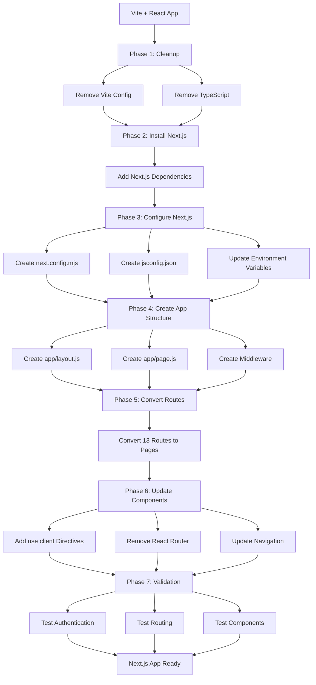

# Design Document: Vite to Next.js Migration

## Overview

This design document outlines the technical approach for migrating an existing Vite + React application to Next.js 14+ using the App Router architecture. The migration will be performed in-place within the same repository, converting all TypeScript files to JavaScript, transforming React Router-based routing to Next.js file-based routing, and preserving all existing functionality including Supabase authentication, Tailwind CSS styling, and shadcn/ui components.

The application is an employee management system (WES OneDesk) with role-based access control (admin, manager, employee), featuring modules for attendance tracking, leave management, salary processing, document management, performance reviews, and announcements. The migration must maintain complete feature parity while adopting Next.js conventions and optimizations.

### Key Migration Principles

1. **In-Place Transformation**: All changes occur within the existing repository structure
2. **JavaScript-First**: Convert all .ts/.tsx files to .js/.jsx, removing TypeScript-specific syntax
3. **Preserve Functionality**: Maintain 100% feature parity during migration
4. **Incremental Validation**: Each phase can be tested independently
5. **Zero Data Loss**: All existing code, components, and integrations remain intact

## Architecture

### Current Architecture (Vite + React)

```
┌─────────────────────────────────────────────────────────────┐
│                     Vite Application                         │
├─────────────────────────────────────────────────────────────┤
│  Entry Point: src/main.tsx                                   │
│  ├─ ReactDOM.render(<App />)                                │
│  └─ Imports: index.css                                       │
├─────────────────────────────────────────────────────────────┤
│  App Component: src/App.tsx                                  │
│  ├─ QueryClientProvider (@tanstack/react-query)             │
│  ├─ AuthProvider (Custom Supabase auth context)             │
│  ├─ TooltipProvider (Radix UI)                              │
│  ├─ Toaster Components (shadcn/ui)                          │
│  └─ BrowserRouter (React Router)                            │
│      └─ Routes                                               │
│          ├─ / → Navigate to /dashboard                      │
│          ├─ /auth → Auth page                               │
│          ├─ /dashboard → Dashboard (Protected)              │
│          ├─ /employees → Employees (Protected: admin/mgr)   │
│          ├─ /employee/:id → Profile (Protected)             │
│          ├─ /attendance → Attendance (Protected)            │
│          ├─ /leaves → Leaves (Protected)                    │
│          ├─ /salaries → Salaries (Protected)                │
│          ├─ /documents → Documents (Protected)              │
│          ├─ /performance → Performance (Protected)          │
│          ├─ /announcements → Announcements (Protected)      │
│          ├─ /institutions → Institutions (Protected: admin) │
│          ├─ /settings → Settings (Protected: admin)         │
│          └─ * → NotFound                                     │
├─────────────────────────────────────────────────────────────┤
│  Components Structure                                        │
│  ├─ src/components/                                          │
│  │   ├─ ui/ (shadcn/ui components - 50+ files)             │
│  │   ├─ attendance/ (5 components)                          │
│  │   ├─ dashboard/ (1 component)                            │
│  │   ├─ layout/ (DashboardLayout)                           │
│  │   ├─ leaves/ (4 components)                              │
│  │   ├─ salary/ (3 components)                              │
│  │   ├─ NavLink.tsx                                          │
│  │   └─ ProtectedRoute.tsx                                  │
│  ├─ src/pages/ (13 page components)                         │
│  ├─ src/hooks/ (useAuth, use-toast, use-mobile)            │
│  ├─ src/integrations/supabase/ (client, types)             │
│  └─ src/lib/ (utils)                                        │
├─────────────────────────────────────────────────────────────┤
│  Configuration                                               │
│  ├─ vite.config.ts (Vite + React SWC + PWA)                │
│  ├─ tsconfig.json (TypeScript configuration)                │
│  ├─ tailwind.config.ts (Tailwind CSS)                       │
│  ├─ postcss.config.js (PostCSS)                             │
│  └─ components.json (shadcn/ui)                             │
├─────────────────────────────────────────────────────────────┤
│  Environment Variables (Vite format)                         │
│  ├─ VITE_SUPABASE_URL                                       │
│  ├─ VITE_SUPABASE_PUBLISHABLE_KEY                          │
│  └─ VITE_SUPABASE_PROJECT_ID                               │
└─────────────────────────────────────────────────────────────┘
```

### Target Architecture (Next.js App Router)

```
┌─────────────────────────────────────────────────────────────┐
│                   Next.js Application                        │
├─────────────────────────────────────────────────────────────┤
│  Root Layout: app/layout.js                                  │
│  ├─ <html> and <body> tags                                  │
│  ├─ Font configuration                                       │
│  ├─ Global CSS imports                                       │
│  ├─ QueryClientProvider (@tanstack/react-query)             │
│  ├─ AuthProvider (Custom Supabase auth context)             │
│  ├─ TooltipProvider (Radix UI)                              │
│  └─ Toaster Components (shadcn/ui)                          │
├─────────────────────────────────────────────────────────────┤
│  Middleware: middleware.js                                   │
│  ├─ Authentication verification (Supabase session)           │
│  ├─ Role-based access control                               │
│  ├─ Redirect unauthenticated users to /auth                 │
│  └─ Redirect authenticated users from /auth to /dashboard   │
├─────────────────────────────────────────────────────────────┤
│  File-Based Routing: app/                                    │
│  ├─ page.js → Redirect to /dashboard                        │
│  ├─ auth/page.js → Auth page                                │
│  ├─ dashboard/page.js → Dashboard                           │
│  ├─ employees/page.js → Employees list                      │
│  ├─ employee/[id]/page.js → Employee profile (dynamic)      │
│  ├─ attendance/page.js → Attendance                         │
│  ├─ leaves/page.js → Leaves                                 │
│  ├─ salaries/page.js → Salaries                             │
│  ├─ documents/page.js → Documents                           │
│  ├─ performance/page.js → Performance                       │
│  ├─ announcements/page.js → Announcements                   │
│  ├─ institutions/page.js → Institutions                     │
│  ├─ settings/page.js → Settings                             │
│  └─ not-found.js → 404 page                                 │
├─────────────────────────────────────────────────────────────┤
│  Components Structure (Preserved)                            │
│  ├─ src/components/ (unchanged location)                    │
│  │   ├─ ui/ (shadcn/ui - add "use client" directives)      │
│  │   ├─ attendance/ (add "use client" directives)          │
│  │   ├─ dashboard/ (add "use client" directives)           │
│  │   ├─ layout/ (DashboardLayout with "use client")        │
│  │   ├─ leaves/ (add "use client" directives)              │
│  │   └─ salary/ (add "use client" directives)              │
│  ├─ src/hooks/ (add "use client" directives)               │
│  ├─ src/integrations/supabase/ (unchanged)                 │
│  └─ src/lib/ (unchanged)                                    │
├─────────────────────────────────────────────────────────────┤
│  Configuration                                               │
│  ├─ next.config.mjs (Next.js configuration)                 │
│  ├─ jsconfig.json (JavaScript path aliases)                 │
│  ├─ tailwind.config.js (Tailwind CSS - converted to JS)     │
│  ├─ postcss.config.js (unchanged)                           │
│  └─ components.json (unchanged)                             │
├─────────────────────────────────────────────────────────────┤
│  Environment Variables (Next.js format)                      │
│  ├─ NEXT_PUBLIC_SUPABASE_URL                               │
│  ├─ NEXT_PUBLIC_SUPABASE_ANON_KEY                          │
│  └─ NEXT_PUBLIC_SUPABASE_PROJECT_ID                        │
└─────────────────────────────────────────────────────────────┘
```

### Migration Flow Diagram



## Components and Interfaces

### 1. Migration System

The Migration System orchestrates the entire conversion process, managing file operations, dependency updates, and configuration transformations.

**Responsibilities:**
- Remove Vite-specific files and dependencies
- Install Next.js dependencies
- Create Next.js configuration files
- Coordinate all migration phases

**Key Operations:**
```javascript
// File removal operations
deleteFiles([
  'vite.config.ts',
  'index.html',
  'src/main.tsx',
  'src/vite-env.d.ts'
])

// Dependency management
removeDependencies([
  'vite',
  '@vitejs/plugin-react-swc',
  'vite-plugin-pwa'
])

addDependencies({
  production: ['next'],
  development: ['@types/node']
})

// Script updates
updatePackageScripts({
  dev: 'next dev',
  build: 'next build',
  start: 'next start',
  lint: 'next lint'
})
```

### 2. TypeScript to JavaScript Converter

Converts all TypeScript files to JavaScript, removing type annotations and updating file extensions.

**Conversion Rules:**
```javascript
// File extension mapping
'.ts' → '.js'
'.tsx' → '.jsx'

// Type annotation removal
interface Props { name: string } → // removed
type AppRole = 'admin' | 'manager' → // removed
const user: User | null → const user

// Import updates
import type { Database } from './types' → // removed if type-only
import { User } from '@supabase/supabase-js' → import { User } from '@supabase/supabase-js'

// Generic removal
useState<User | null>(null) → useState(null)
createContext<AuthContextType>() → createContext()

// Assertion removal
document.getElementById('root')! → document.getElementById('root')
```

**Files to Convert:**
- All files in `src/` directory (60+ files)
- Configuration files: `tailwind.config.ts` → `tailwind.config.js`
- Type definition files: Remove or convert to JSDoc comments

### 3. Route Converter

Transforms React Router configuration to Next.js file-based routing structure.

**Route Mapping:**
```javascript
// React Router → Next.js App Router
{
  '/': 'app/page.js',                    // Redirect to /dashboard
  '/auth': 'app/auth/page.js',
  '/dashboard': 'app/dashboard/page.js',
  '/employees': 'app/employees/page.js',
  '/employee/:id': 'app/employee/[id]/page.js',  // Dynamic route
  '/attendance': 'app/attendance/page.js',
  '/leaves': 'app/leaves/page.js',
  '/salaries': 'app/salaries/page.js',
  '/documents': 'app/documents/page.js',
  '/performance': 'app/performance/page.js',
  '/announcements': 'app/announcements/page.js',
  '/institutions': 'app/institutions/page.js',
  '/settings': 'app/settings/page.js',
  '*': 'app/not-found.js'
}
```

**Page Component Template:**
```javascript
// app/dashboard/page.js
'use client'

import Dashboard from '@/pages/Dashboard'

export default function DashboardPage() {
  return <Dashboard />
}
```

**Dynamic Route Template:**
```javascript
// app/employee/[id]/page.js
'use client'

import EmployeeProfile from '@/pages/EmployeeProfile'

export default function EmployeeProfilePage({ params }) {
  return <EmployeeProfile id={params.id} />
}
```

### 4. Environment Adapter

Converts Vite environment variables to Next.js format.

**Transformation Rules:**
```javascript
// .env file updates
VITE_SUPABASE_URL → NEXT_PUBLIC_SUPABASE_URL
VITE_SUPABASE_PUBLISHABLE_KEY → NEXT_PUBLIC_SUPABASE_ANON_KEY
VITE_SUPABASE_PROJECT_ID → NEXT_PUBLIC_SUPABASE_PROJECT_ID

// Code updates
import.meta.env.VITE_SUPABASE_URL → process.env.NEXT_PUBLIC_SUPABASE_URL
import.meta.env.VITE_SUPABASE_PUBLISHABLE_KEY → process.env.NEXT_PUBLIC_SUPABASE_ANON_KEY
```

**Files Requiring Updates:**
- `src/integrations/supabase/client.js`
- Any component accessing environment variables

### 5. Authentication Middleware

Implements Next.js middleware for authentication and authorization.

**Interface:**
```javascript
// middleware.js
export async function middleware(request) {
  // Returns: NextResponse (redirect or continue)
}

export const config = {
  matcher: [
    '/((?!_next/static|_next/image|favicon.ico|.*\\.(?:svg|png|jpg|jpeg|gif|webp)$).*)',
  ]
}
```

**Authentication Flow:**
```javascript
async function middleware(request) {
  const { pathname } = request.nextUrl
  
  // Get Supabase session from cookies
  const session = await getSession(request)
  
  // Public routes
  if (pathname === '/auth') {
    if (session) {
      return NextResponse.redirect(new URL('/dashboard', request.url))
    }
    return NextResponse.next()
  }
  
  // Protected routes
  if (!session) {
    return NextResponse.redirect(new URL('/auth', request.url))
  }
  
  // Role-based access control
  const userRole = await getUserRole(session.user.id)
  
  const adminOnlyRoutes = ['/institutions', '/settings']
  const adminManagerRoutes = ['/employees']
  
  if (adminOnlyRoutes.includes(pathname) && userRole !== 'admin') {
    return NextResponse.redirect(new URL('/dashboard', request.url))
  }
  
  if (adminManagerRoutes.includes(pathname) && 
      !['admin', 'manager'].includes(userRole)) {
    return NextResponse.redirect(new URL('/dashboard', request.url))
  }
  
  return NextResponse.next()
}
```

### 6. Client Component Marker

Identifies and marks components that require the "use client" directive.

**Detection Criteria:**
- Uses React hooks (useState, useEffect, useContext, etc.)
- Uses browser APIs (window, document, localStorage, etc.)
- Has event handlers (onClick, onChange, onSubmit, etc.)
- Uses client-side routing (useNavigate, useLocation, useParams)
- Imports from libraries that require client-side execution

**Components Requiring "use client":**
```javascript
// All page components (they use hooks and navigation)
app/dashboard/page.js
app/auth/page.js
// ... all other pages

// Layout components
src/components/layout/DashboardLayout.jsx

// Feature components
src/components/attendance/*.jsx
src/components/dashboard/*.jsx
src/components/leaves/*.jsx
src/components/salary/*.jsx

// UI components (shadcn/ui)
src/components/ui/*.jsx (most of them)

// Hooks
src/hooks/useAuth.jsx
src/hooks/use-mobile.jsx
src/hooks/use-toast.js
```

### 7. Navigation Updater

Replaces React Router navigation with Next.js navigation.

**Replacement Rules:**
```javascript
// Imports
import { useNavigate, useLocation, useParams, Link } from 'react-router-dom'
→
import { useRouter, usePathname, useParams } from 'next/navigation'
import Link from 'next/link'

// Hook usage
const navigate = useNavigate()
navigate('/dashboard')
→
const router = useRouter()
router.push('/dashboard')

// Location
const location = useLocation()
const pathname = location.pathname
→
const pathname = usePathname()

// Link component
<Link to="/dashboard">Dashboard</Link>
→
<Link href="/dashboard">Dashboard</Link>

// Params (in dynamic routes)
// React Router: useParams() in component
// Next.js: params prop passed to page component
```

## Data Models

### Configuration Files

#### next.config.mjs
```javascript
/** @type {import('next').NextConfig} */
const nextConfig = {
  reactStrictMode: true,
  images: {
    domains: ['glijytescdhdtihzlhlg.supabase.co'],
  },
  // Preserve path alias
  webpack: (config) => {
    config.resolve.alias = {
      ...config.resolve.alias,
      '@': './src',
    }
    return config
  },
}

export default nextConfig
```

#### jsconfig.json
```json
{
  "compilerOptions": {
    "baseUrl": ".",
    "paths": {
      "@/*": ["./src/*"]
    },
    "target": "ES2020",
    "lib": ["ES2020", "DOM", "DOM.Iterable"],
    "module": "ESNext",
    "moduleResolution": "bundler",
    "jsx": "preserve",
    "strict": false,
    "esModuleInterop": true,
    "skipLibCheck": true,
    "forceConsistentCasingInFileNames": true,
    "resolveJsonModule": true,
    "isolatedModules": true,
    "incremental": true
  },
  "include": [
    "next-env.d.js",
    "**/*.js",
    "**/*.jsx",
    ".next/types/**/*.js"
  ],
  "exclude": [
    "node_modules"
  ]
}
```

#### package.json (updated scripts)
```json
{
  "scripts": {
    "dev": "next dev",
    "build": "next build",
    "start": "next start",
    "lint": "next lint"
  },
  "dependencies": {
    "next": "^14.2.0",
    "react": "^18.3.1",
    "react-dom": "^18.3.1",
    "@supabase/supabase-js": "^2.89.0",
    "@tanstack/react-query": "^5.90.12",
    // ... all other existing dependencies preserved
  },
  "devDependencies": {
    "@types/node": "^22.16.5",
    "autoprefixer": "^10.4.21",
    "postcss": "^8.5.6",
    "tailwindcss": "^3.4.17",
    "eslint": "^9.32.0",
    "eslint-config-next": "^14.2.0"
  }
}
```

### Root Layout Structure

#### app/layout.js
```javascript
'use client'

import { QueryClient, QueryClientProvider } from '@tanstack/react-query'
import { AuthProvider } from '@/hooks/useAuth'
import { TooltipProvider } from '@/components/ui/tooltip'
import { Toaster } from '@/components/ui/toaster'
import { Toaster as Sonner } from '@/components/ui/sonner'
import '@/index.css'

const queryClient = new QueryClient()

export default function RootLayout({ children }) {
  return (
    <html lang="en">
      <body>
        <QueryClientProvider client={queryClient}>
          <AuthProvider>
            <TooltipProvider>
              {children}
              <Toaster />
              <Sonner />
            </TooltipProvider>
          </AuthProvider>
        </QueryClientProvider>
      </body>
    </html>
  )
}
```

### Middleware Structure

#### middleware.js
```javascript
import { createMiddlewareClient } from '@supabase/auth-helpers-nextjs'
import { NextResponse } from 'next/server'

export async function middleware(request) {
  const res = NextResponse.next()
  const supabase = createMiddlewareClient({ req: request, res })
  
  const {
    data: { session },
  } = await supabase.auth.getSession()
  
  const { pathname } = request.nextUrl
  
  // Redirect authenticated users away from auth page
  if (pathname === '/auth' && session) {
    return NextResponse.redirect(new URL('/dashboard', request.url))
  }
  
  // Protect all routes except auth
  if (pathname !== '/auth' && !session) {
    return NextResponse.redirect(new URL('/auth', request.url))
  }
  
  // Role-based access control
  if (session) {
    const { data: roleData } = await supabase
      .from('user_roles')
      .select('role')
      .eq('user_id', session.user.id)
      .maybeSingle()
    
    const role = roleData?.role || 'employee'
    
    // Admin-only routes
    if (['/institutions', '/settings'].includes(pathname) && role !== 'admin') {
      return NextResponse.redirect(new URL('/dashboard', request.url))
    }
    
    // Admin and Manager routes
    if (pathname === '/employees' && !['admin', 'manager'].includes(role)) {
      return NextResponse.redirect(new URL('/dashboard', request.url))
    }
  }
  
  return res
}

export const config = {
  matcher: [
    '/((?!_next/static|_next/image|favicon.ico|.*\\.(?:svg|png|jpg|jpeg|gif|webp)$).*)',
  ],
}
```

### File Structure Mapping

```
Before (Vite):                    After (Next.js):
├── index.html                    [DELETED]
├── vite.config.ts                [DELETED]
├── tsconfig.json                 → jsconfig.json
├── tsconfig.app.json             [DELETED]
├── tsconfig.node.json            [DELETED]
├── tailwind.config.ts            → tailwind.config.js
├── package.json                  → package.json (updated)
├── .env                          → .env (updated variable names)
├── src/
│   ├── main.tsx                  [DELETED]
│   ├── vite-env.d.ts            [DELETED]
│   ├── App.tsx                   [DELETED - logic moved to layout]
│   ├── index.css                 → src/index.css (unchanged)
│   ├── components/               → src/components/ (add "use client")
│   ├── hooks/                    → src/hooks/ (add "use client")
│   ├── integrations/             → src/integrations/ (update env vars)
│   ├── lib/                      → src/lib/ (unchanged)
│   └── pages/                    → src/pages/ (kept as components)
└── public/                       → public/ (unchanged)

New Files:
├── app/
│   ├── layout.js                 [NEW]
│   ├── page.js                   [NEW]
│   ├── not-found.js              [NEW]
│   ├── auth/page.js              [NEW]
│   ├── dashboard/page.js         [NEW]
│   ├── employees/page.js         [NEW]
│   ├── employee/[id]/page.js     [NEW]
│   ├── attendance/page.js        [NEW]
│   ├── leaves/page.js            [NEW]
│   ├── salaries/page.js          [NEW]
│   ├── documents/page.js         [NEW]
│   ├── performance/page.js       [NEW]
│   ├── announcements/page.js     [NEW]
│   ├── institutions/page.js      [NEW]
│   └── settings/page.js          [NEW]
├── middleware.js                 [NEW]
├── next.config.mjs               [NEW]
└── jsconfig.json                 [NEW]
```


## Correctness Properties

A property is a characteristic or behavior that should hold true across all valid executions of a system—essentially, a formal statement about what the system should do. Properties serve as the bridge between human-readable specifications and machine-verifiable correctness guarantees.

### Property Reflection

After analyzing all acceptance criteria, I identified several redundant properties that can be consolidated:

**Redundancies Identified:**
1. Requirements 1.7 and 1.8 are subsumed by 1.5 (all Vite dependencies removal)
2. Requirement 7.5 is redundant with 7.2 (environment variable conversion)
3. Requirement 14.1 is redundant with 1.5 (vite-plugin-pwa removal)
4. Requirement 15.5 is redundant with 6.1 (authentication enforcement)
5. Requirement 15.8 is redundant with 9.6 (production build success)
6. Multiple file existence checks (5.1-5.13) can be combined into a single property about route file creation
7. Requirements 11.1, 11.2, and 11.3 can be combined into a single comprehensive property about "use client" directives

**Properties After Consolidation:**
- File removal operations → Single property about Vite artifacts
- Route creation operations → Single property about all route files
- "use client" directive requirements → Single comprehensive property
- Environment variable conversion → Single property about all conversions

### Property 1: Vite Artifact Removal

For any file that is part of the Vite build system (vite.config.ts, index.html, src/main.tsx, src/vite-env.d.ts) or any dependency that is Vite-specific (vite, @vitejs/plugin-react-swc, vite-plugin-pwa), after migration these SHALL NOT exist in the project.

**Validates: Requirements 1.1, 1.2, 1.3, 1.4, 1.5, 1.6, 1.7, 1.8, 14.1**

### Property 2: Next.js Route File Creation

For any route defined in the original React Router configuration (/, /auth, /dashboard, /employees, /employee/:id, /attendance, /leaves, /salaries, /documents, /performance, /announcements, /institutions, /settings, and 404), there SHALL exist a corresponding Next.js page file in the app directory with the correct file-based routing structure.

**Validates: Requirements 5.1, 5.2, 5.3, 5.4, 5.5, 5.6, 5.7, 5.8, 5.9, 5.10, 5.11, 5.12, 5.13**

### Property 3: React Router Elimination

For any file in the codebase after migration, it SHALL NOT contain imports from 'react-router-dom'.

**Validates: Requirements 5.15**

### Property 4: Authentication Redirect for Unauthenticated Users

For any protected route (all routes except /auth), when accessed without a valid Supabase session, the application SHALL redirect to /auth.

**Validates: Requirements 6.1, 15.5**

### Property 5: Authentication Redirect for Authenticated Users

For any request to /auth when a valid Supabase session exists, the application SHALL redirect to /dashboard.

**Validates: Requirements 6.2**

### Property 6: Role-Based Access Control

For any user with role 'employee' accessing admin-only routes (/institutions, /settings) or manager routes (/employees), the application SHALL redirect to /dashboard. For any user with role 'manager' accessing admin-only routes (/institutions, /settings), the application SHALL redirect to /dashboard.

**Validates: Requirements 6.4**

### Property 7: Environment Variable Conversion

For any environment variable access in the codebase after migration, it SHALL use process.env instead of import.meta.env, and all client-side variables SHALL be prefixed with NEXT_PUBLIC_.

**Validates: Requirements 7.1, 7.2, 7.5**

### Property 8: Client Component Directive

For any component file that uses React hooks (useState, useEffect, useContext, useCallback, useMemo, useRef, etc.), browser APIs (window, document, localStorage, navigator, etc.), or event handlers (onClick, onChange, onSubmit, etc.), the file SHALL begin with the 'use client' directive.

**Validates: Requirements 11.1, 11.2, 11.3, 11.5**

### Property 9: Vite Type Reference Elimination

For any file in the codebase after migration, it SHALL NOT contain references to Vite-specific types or imports (such as 'vite/client', ImportMetaEnv, or vite-env.d.ts).

**Validates: Requirements 12.7**

### Property 10: Navigation Functionality

For any valid route in the application, when a user navigates to that route (either directly or through Link components), the application SHALL display the correct page content without errors.

**Validates: Requirements 15.3**

## Error Handling

### Migration Process Errors

**File Operation Errors:**
- If a file to be deleted does not exist, log a warning but continue migration
- If a file to be created already exists, prompt user for overwrite confirmation
- If file permissions prevent operations, halt migration with clear error message

**Dependency Installation Errors:**
- If npm install fails, display the npm error output and halt migration
- If package.json is malformed, halt migration with validation error
- If dependency conflicts exist, display conflict details and suggest resolutions

**Configuration Errors:**
- If environment variables are missing, halt migration with list of required variables
- If Supabase configuration is invalid, halt migration with validation error
- If path aliases cannot be resolved, halt migration with configuration error

### Runtime Errors

**Authentication Errors:**
- If Supabase session cannot be retrieved, redirect to /auth with error message
- If role lookup fails, default to 'employee' role and log warning
- If middleware encounters errors, allow request to proceed and log error

**Navigation Errors:**
- If a route does not exist, display 404 page (app/not-found.js)
- If navigation fails due to client-side error, display error boundary
- If dynamic route parameter is invalid, display 404 page

**Component Errors:**
- If a component fails to render, display error boundary with error details
- If "use client" directive is missing, Next.js will show build error
- If Supabase query fails, display error toast and log error

**Build Errors:**
- If JavaScript syntax errors exist, display build error with file and line number
- If imports cannot be resolved, display module resolution error
- If environment variables are missing at build time, display configuration error

### Error Recovery Strategies

**Graceful Degradation:**
- If dashboard stats fail to load, display empty state with retry button
- If user profile cannot be fetched, display generic user icon
- If announcements fail to load, hide announcements section

**Retry Logic:**
- Supabase queries: Retry up to 3 times with exponential backoff
- Authentication checks: Retry once on network error
- File uploads: Allow manual retry with progress indication

**User Feedback:**
- Display toast notifications for all user-facing errors
- Show loading states during async operations
- Provide clear error messages with actionable next steps

## Testing Strategy

### Dual Testing Approach

This migration requires both unit tests and property-based tests to ensure comprehensive coverage:

**Unit Tests** focus on:
- Specific migration steps (file creation, deletion, modification)
- Configuration file content validation
- Individual component functionality after conversion
- Edge cases in authentication and authorization
- Integration points between Next.js and Supabase

**Property-Based Tests** focus on:
- Universal properties that hold across all files (no React Router imports, correct "use client" directives)
- Behavioral properties that hold for all routes (authentication redirects, role-based access)
- Consistency properties across the codebase (environment variable format, import patterns)

### Unit Testing Strategy

**Migration Validation Tests:**
```javascript
describe('Vite Artifact Removal', () => {
  test('vite.config.ts should not exist', () => {
    expect(fs.existsSync('vite.config.ts')).toBe(false)
  })
  
  test('index.html should not exist', () => {
    expect(fs.existsSync('index.html')).toBe(false)
  })
  
  test('package.json should not contain vite dependencies', () => {
    const pkg = JSON.parse(fs.readFileSync('package.json', 'utf8'))
    expect(pkg.dependencies?.vite).toBeUndefined()
    expect(pkg.devDependencies?.vite).toBeUndefined()
  })
})

describe('Next.js Configuration', () => {
  test('next.config.mjs should exist', () => {
    expect(fs.existsSync('next.config.mjs')).toBe(true)
  })
  
  test('next.config.mjs should have correct path alias', () => {
    const config = require('./next.config.mjs')
    expect(config.webpack).toBeDefined()
  })
  
  test('jsconfig.json should have @ path alias', () => {
    const jsconfig = JSON.parse(fs.readFileSync('jsconfig.json', 'utf8'))
    expect(jsconfig.compilerOptions.paths['@/*']).toEqual(['./src/*'])
  })
})

describe('Route Files', () => {
  const routes = [
    'app/page.js',
    'app/auth/page.js',
    'app/dashboard/page.js',
    'app/employees/page.js',
    'app/employee/[id]/page.js',
    'app/attendance/page.js',
    'app/leaves/page.js',
    'app/salaries/page.js',
    'app/documents/page.js',
    'app/performance/page.js',
    'app/announcements/page.js',
    'app/institutions/page.js',
    'app/settings/page.js',
    'app/not-found.js'
  ]
  
  routes.forEach(route => {
    test(`${route} should exist`, () => {
      expect(fs.existsSync(route)).toBe(true)
    })
  })
})

describe('Environment Variables', () => {
  test('Supabase client should use NEXT_PUBLIC_ variables', () => {
    const clientCode = fs.readFileSync('src/integrations/supabase/client.js', 'utf8')
    expect(clientCode).toContain('NEXT_PUBLIC_SUPABASE_URL')
    expect(clientCode).toContain('NEXT_PUBLIC_SUPABASE_ANON_KEY')
    expect(clientCode).not.toContain('VITE_')
  })
})
```

**Component Functionality Tests:**
```javascript
describe('Authentication Flow', () => {
  test('useAuth hook should work after migration', () => {
    const { result } = renderHook(() => useAuth())
    expect(result.current).toHaveProperty('user')
    expect(result.current).toHaveProperty('signIn')
    expect(result.current).toHaveProperty('signOut')
  })
  
  test('DashboardLayout should render without errors', () => {
    render(<DashboardLayout><div>Test</div></DashboardLayout>)
    expect(screen.getByText('Test')).toBeInTheDocument()
  })
})

describe('Navigation', () => {
  test('Link components should use Next.js Link', () => {
    const layoutCode = fs.readFileSync('src/components/layout/DashboardLayout.jsx', 'utf8')
    expect(layoutCode).toContain("from 'next/link'")
    expect(layoutCode).not.toContain("from 'react-router-dom'")
  })
})
```

**Build and Runtime Tests:**
```javascript
describe('Build Process', () => {
  test('npm run build should succeed', async () => {
    const result = await exec('npm run build')
    expect(result.exitCode).toBe(0)
    expect(fs.existsSync('.next')).toBe(true)
  })
  
  test('npm run dev should start server', async () => {
    const server = exec('npm run dev')
    await waitForServer('http://localhost:3000', 30000)
    expect(await fetch('http://localhost:3000')).toHaveProperty('status', 200)
    server.kill()
  })
})
```

### Property-Based Testing Strategy

**Library:** Use `fast-check` for JavaScript property-based testing

**Configuration:** Minimum 100 iterations per property test

**Test Tags:** Each test references its design document property

```javascript
import fc from 'fast-check'

describe('Property Tests', () => {
  test('Property 3: No React Router imports in any file', () => {
    // Feature: vite-to-nextjs-migration, Property 3: For any file in the codebase after migration, it SHALL NOT contain imports from 'react-router-dom'
    
    fc.assert(
      fc.property(
        fc.constantFrom(...getAllJavaScriptFiles()),
        (filePath) => {
          const content = fs.readFileSync(filePath, 'utf8')
          return !content.includes("from 'react-router-dom'") &&
                 !content.includes('from "react-router-dom"')
        }
      ),
      { numRuns: 100 }
    )
  })
  
  test('Property 7: All environment variables use correct format', () => {
    // Feature: vite-to-nextjs-migration, Property 7: For any environment variable access in the codebase after migration, it SHALL use process.env instead of import.meta.env
    
    fc.assert(
      fc.property(
        fc.constantFrom(...getAllJavaScriptFiles()),
        (filePath) => {
          const content = fs.readFileSync(filePath, 'utf8')
          const hasImportMeta = content.includes('import.meta.env')
          const hasProcessEnv = content.includes('process.env')
          
          // If file accesses env vars, it should use process.env, not import.meta.env
          if (hasImportMeta || hasProcessEnv) {
            return !hasImportMeta && hasProcessEnv
          }
          return true
        }
      ),
      { numRuns: 100 }
    )
  })
  
  test('Property 8: Components with hooks have use client directive', () => {
    // Feature: vite-to-nextjs-migration, Property 8: For any component file that uses React hooks, the file SHALL begin with the 'use client' directive
    
    fc.assert(
      fc.property(
        fc.constantFrom(...getComponentFiles()),
        (filePath) => {
          const content = fs.readFileSync(filePath, 'utf8')
          const usesHooks = /use(State|Effect|Context|Callback|Memo|Ref|Reducer|LayoutEffect)\(/.test(content)
          const hasUseClient = content.trim().startsWith("'use client'") || 
                              content.trim().startsWith('"use client"')
          
          // If component uses hooks, it must have 'use client'
          if (usesHooks) {
            return hasUseClient
          }
          return true
        }
      ),
      { numRuns: 100 }
    )
  })
  
  test('Property 9: No Vite type references in any file', () => {
    // Feature: vite-to-nextjs-migration, Property 9: For any file in the codebase after migration, it SHALL NOT contain references to Vite-specific types
    
    fc.assert(
      fc.property(
        fc.constantFrom(...getAllJavaScriptFiles()),
        (filePath) => {
          const content = fs.readFileSync(filePath, 'utf8')
          return !content.includes('vite/client') &&
                 !content.includes('ImportMetaEnv') &&
                 !content.includes('vite-env.d.ts')
        }
      ),
      { numRuns: 100 }
    )
  })
})

describe('Authentication Property Tests', () => {
  test('Property 4: Unauthenticated access redirects to /auth', async () => {
    // Feature: vite-to-nextjs-migration, Property 4: For any protected route, when accessed without a valid Supabase session, the application SHALL redirect to /auth
    
    const protectedRoutes = [
      '/dashboard',
      '/employees',
      '/attendance',
      '/leaves',
      '/salaries',
      '/documents',
      '/performance',
      '/announcements',
      '/institutions',
      '/settings'
    ]
    
    await fc.assert(
      fc.asyncProperty(
        fc.constantFrom(...protectedRoutes),
        async (route) => {
          const response = await fetch(`http://localhost:3000${route}`, {
            redirect: 'manual'
          })
          
          // Should redirect (status 307 or 302)
          return response.status === 307 || response.status === 302
        }
      ),
      { numRuns: 100 }
    )
  })
  
  test('Property 6: Role-based access control enforced', async () => {
    // Feature: vite-to-nextjs-migration, Property 6: For any user with role 'employee' accessing admin routes, the application SHALL redirect to /dashboard
    
    const adminRoutes = ['/institutions', '/settings']
    const managerRoutes = ['/employees']
    
    await fc.assert(
      fc.asyncProperty(
        fc.constantFrom(...adminRoutes, ...managerRoutes),
        fc.constantFrom('employee', 'manager'),
        async (route, role) => {
          // Create session with specified role
          const session = await createTestSession(role)
          
          const response = await fetch(`http://localhost:3000${route}`, {
            headers: { Cookie: session.cookie },
            redirect: 'manual'
          })
          
          // Employee should be redirected from all admin/manager routes
          if (role === 'employee') {
            return response.status === 307 || response.status === 302
          }
          
          // Manager should be redirected from admin-only routes
          if (role === 'manager' && adminRoutes.includes(route)) {
            return response.status === 307 || response.status === 302
          }
          
          return true
        }
      ),
      { numRuns: 100 }
    )
  })
})
```

### Integration Testing

**End-to-End Tests:**
- Complete user flows (login → dashboard → navigation → logout)
- Form submissions (attendance, leave applications, salary processing)
- Data persistence (Supabase integration)
- File uploads and downloads
- Role-based feature access

**Cross-Browser Testing:**
- Chrome, Firefox, Safari, Edge
- Mobile browsers (iOS Safari, Chrome Mobile)
- Responsive design validation

**Performance Testing:**
- Page load times
- Time to Interactive (TTI)
- First Contentful Paint (FCP)
- Largest Contentful Paint (LCP)

### Migration Validation Checklist

After migration, verify:
- [ ] All Vite files removed
- [ ] Next.js configuration files created
- [ ] All routes accessible
- [ ] Authentication works
- [ ] Role-based access enforced
- [ ] Environment variables correct
- [ ] Supabase integration functional
- [ ] All components render
- [ ] Styling preserved
- [ ] Navigation works
- [ ] Build succeeds
- [ ] Dev server starts
- [ ] Production build works
- [ ] No console errors
- [ ] All tests pass

